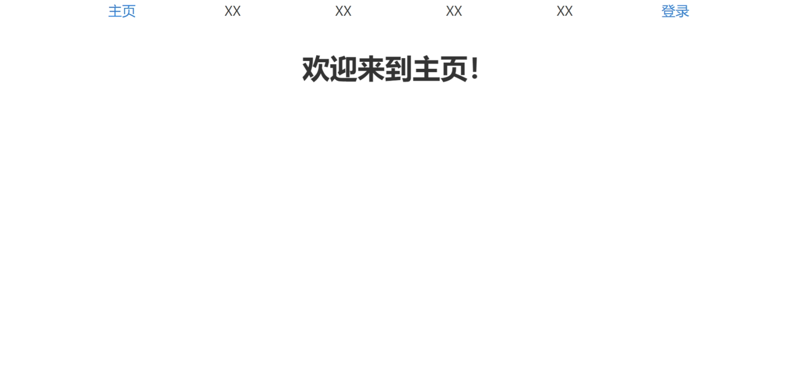
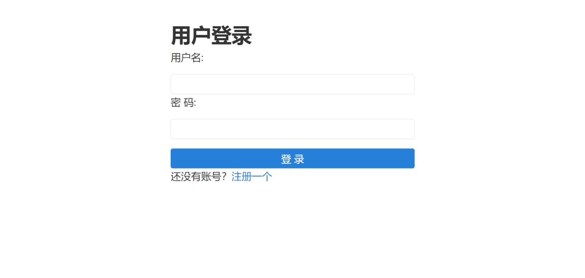
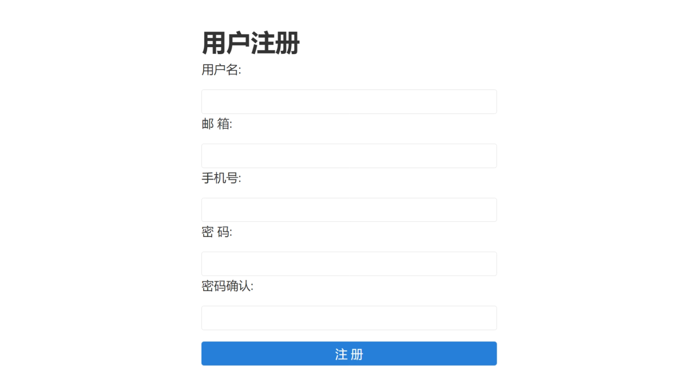
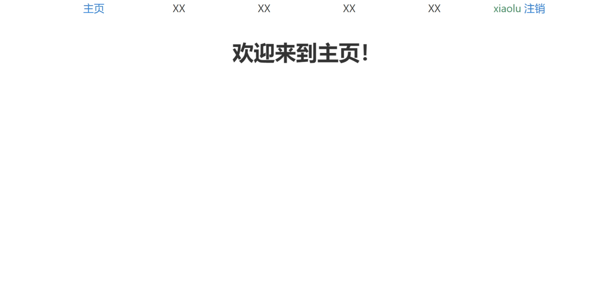

最简实现：扩展django User模型并使用内置的认证系统实现用户注册、登录、注销功能。

# 前端页面：

模板使用轻量级的[Mobi.css框架](http://getmobicss.com)。

# 后端实现
## 1，扩展 User 模型
扩展内置 User 的方式有很多，这里直接继承 AbstractUser，并添加了一个 mobile 字段。

## 2，用户注册
定义继承 Form 的 RegisterForm 实现注册表单： 
- 用指定小部件渲染个字段；
- 定义 error_messages；
- 定义 clean_confirm_password 清洗表单字段。

获取清洗后的密码明文数据，用 make_password 加密密码；
注册数据成功保存后，重定向到主页。

## 3，用户登录
定义继承 Form 的 LoginForm 实现登录表单： 
- 用指定小部件渲染个字段。

获取清洗后的登录数据，用 authenticate 验证身份；
验证通过后，用 login 实现插值登录，并重定向到主页。

## 4，用户注销
用 logout 注销登录，并重定向到主页。

## 5，主页
根据当前用户是否认证通过，在页面显示 （用户名 注销）/ 登录 按钮。