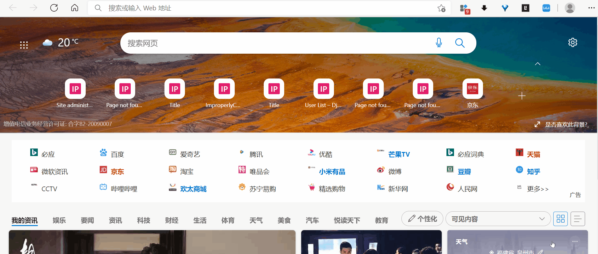

最简单实现：使用django自带的分页组件实现分页

# 一，前端页面：

前端由DTL实现，详见模板文件：
```html
<!DOCTYPE html>
<html lang="en">
<head>
    <meta charset="UTF-8">
    <title>Title</title>
    <style type="text/css">
        .pagination {
            align-self: center;
            padding: 10px;
            text-align: center;
            background-color: #000402;
            margin: 10px auto;
        }

        a {
            padding: 5px 10px;
            color: white;
            background-color: #2caa0d;
            margin: 1px; /*设置标签 a 之间的间隔*/
            text-decoration: none; /*去除页码数字下面的下划线*/
        }

        a:hover {
            padding: 5px 10px;
            color: white;
            background-color: #64d448;
            margin: 1px; /*设置标签 a 之间的间隔*/
            text-decoration: none; /*去除页码数字下面的下划线*/
        }

        a[class$='end-left'] {
            background-color: #7b2edb;
            border-radius: 10px 1px 1px 10px;
        }

        a[class$='end-left']:hover {
            background-color: #9965d9;
        }

        a[class$='end-right'] {
            background-color: #7b2edb;
            border-radius: 1px 10px 10px 1px;
        }

        a[class$='end-right']:hover {
            background-color: #9965d9;
        }

        .current {
            padding: 5px 10px;
            color: white;
            background-color: #64d448;
            margin-top: 10px;
            text-decoration: none; /*去除页码数字下面的下划线*/
        }

        .more-page {
            color: white;
        }
    </style>
</head>
<body>
<div>
    
        {# Each "school" is a SchoolInfo model object. #}
        <ul>
            <li>
                {{ school.name }}<br>
            </li>
        </ul>
    
</div>

<div class="pagination">
    <span class="step-links">
        
            {#            <a class="page-link" href="?page=1">&laquo; 第一页</a>#}
            <a class="page-link end-left" href="?page={{ page_obj.previous_page_number }}"><<</a>
        

        
            
                <span class="page-link current">{{ i }}</span>
            
                
                    <span class="page-link more-page">{{ i }}</span>
                
                    <a class="page-link" href="?page={{ i }}">{{ i }}</a>
                
            
        

        
            <a class="page-link end-right" href="?page={{ page_obj.next_page_number }}">>></a>
            {#            <a class="page-link" href="?page={{ page_obj.paginator.num_pages }}">最后一页 &raquo;</a>#}
        
    </span>
</div>
</body>
</html>
```
1，渲染页对象中的数据
2，对页码进行合理的切割，用法比较固定。

# 二，后端实现

基本的分页功能由django自带的分页组件实现。

## （一）FBV
详见[在视图函数中使用 Paginator](https://docs.djangoproject.com/zh-hans/4.0/topics/pagination/#using-paginator-in-a-view-function) ，模板文件用[这个](https://docs.djangoproject.com/zh-hans/4.0/topics/pagination/#:~:text=%E7%9A%84%E9%93%BE%E6%8E%A5%EF%BC%8C-,%E5%A6%82%E4%B8%8B%E6%89%80%E7%A4%BA,-%EF%BC%9A) 。

1，创建分页器实例。

2，获取轻轻中的页码数。

3，根据页码数，从分页实例中获取所需的页对象。

4，将页对象作为上下文传递给模板。


但示例代码有几个缺点：

1，会将所有页码全显示出来。

2，对默认访问不友好。

改进：

1，页码改进：使用 django 3.2 开始提供的[Paginator.get_elided_page_range](https://docs.djangoproject.com/zh-hans/4.0/ref/paginator/#django.core.paginator.Paginator.get_elided_page_range)
来合理切割页码.
```python
...
    paginator.get_elided_page_range(number=page_number, on_each_side=2)
    context = {
        'page_obj': page_obj,
        'page_range': page_range
    }
...
```
具体渲染方式见前端模板文件，用法比较固定。

2，访问逻辑改进：
判断捕获的请求参数中的 page 是否为一个页码数字，来访问合适的路由：是的话，说明URL中携带了这个参数，按指定的来访问；否的话，说明说明URL中未携带这个参数，默认重定向到第一页。
```python
...
    page_number = request.GET.get('page', None)

    try:
        page_obj = paginator.get_page(page_number)
        ...
        return render(request, 'list.html', context)
    except PageNotAnInteger as e:
        return redirect(to="/schools/?page=1", permanent=True)
...
```

## （二）CBV
由于已经结合 FBV 实现了模板，所以关键就是使用 CBV 提供 page_obj 与 page_range 作为上下文。

CBV 选用 ListView 来渲染数据列表。

实际上 page_obj 由 get_context_data 提供到上下文中，所以只需要重写这个方法来额外添加 page_range 就行：
```python
class StudentList(ListView):
    model = StudentInfo
    template_name = 'list.html'
    object_list = StudentInfo.objects.all()
    paginate_by = 25

    def get_context_data(self, **kwargs):
        context = super(StudentList, self).get_context_data(**kwargs)
        page = self.kwargs.get(self.page_kwarg) or self.request.GET.get(self.page_kwarg) or 1
        try:
            self.page_number = int(page)
        except ValueError:
            self.page_number = 1    # 重定向
        finally:
            page_range = context['paginator'].get_elided_page_range(number=self.page_number, on_each_side=2)
            context['page_range'] = page_range  # 添加额外的键值对，传到模板中
        return context
```

基于配置思想的 CBV 确实比较方便，但要熟悉源码，才能对抽象出去的逻辑进行自定义。 