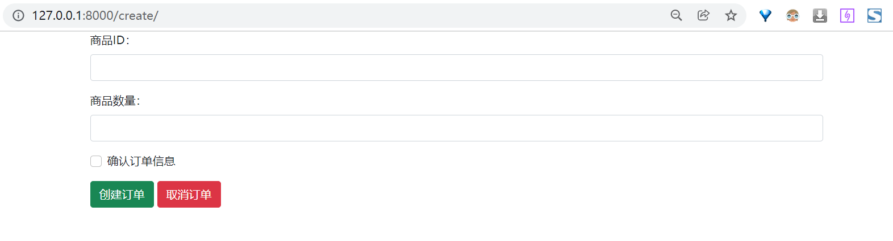
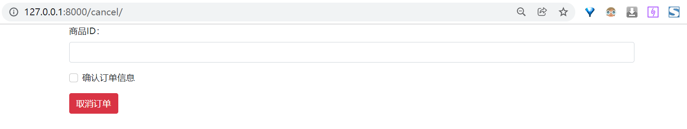

最简实现：
使用信号实现不同模型之间的数据联动：实现订单中商品数量影响商品库存数量

### 前端页面：

使用`bootstrap 5`的 [表单组件](https://v5.bootcss.com/docs/forms/overview/) 。
- 用 formaction 属性区分不同的提交按钮的目的地。
### 后端实现：
使用内置的 [post_save](https://docs.djangoproject.com/en/4.0/ref/signals/#post-save) 信号，注册商品库存数量操作函数，并由订单处理实现触发。

视图函数使用`field_value = request.POST.get('field_name', '')`的方式从表单中获取字段值。
- 使用`@csrf_exempt`关闭了跨域请求认证。